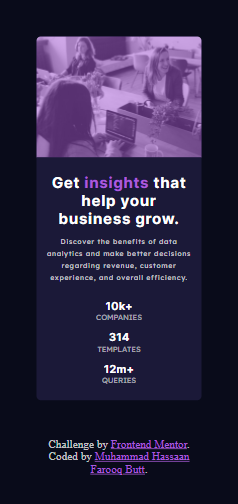

# Frontend Mentor - Stats preview card component solution

This is a solution to the [Stats preview card component challenge on Frontend Mentor](https://www.frontendmentor.io/challenges/stats-preview-card-component-8JqbgoU62). Frontend Mentor challenges help us improve our coding skills by building realistic projects.

## Table of contents

- [Overview](#overview)
  - [The challenge](#the-challenge)
  - [Screenshot](#screenshot)
  - [Links](#links)
- [My process](#my-process)
  - [Built with](#built-with)
  - [What I learned](#what-i-learned)
  - [Useful resources](#useful-resources)
- [Author](#author)
- [Acknowledgments](#acknowledgments)

## Overview

### The challenge

Users should be able to:

- View the optimal layout depending on their device's screen size

### Screenshot




### Links

<!-- - Solution URL: [Add solution URL here](https://your-solution-url.com) -->

- Live Site URL: [Add live site URL here](https://mhassaanbutt.github.io/stats-preview-card/)

## My process

### Built with

- Semantic HTML5 markup
- CSS custom properties
- Flexbox
<!-- - CSS Grid -->
- Mobile-first workflow
<!-- - [React](https://reactjs.org/) - JS library
- [Next.js](https://nextjs.org/) - React framework
- [Styled Components](https://styled-components.com/) - For styles -->

### What I learned

I learned the most important thing during solving challenge is that SASS is more usable and flexible to use instead of simple CSS. We can define varibles and functions I can maintain a proper hierarchy for our peoject. Flexbox makes work easy to design mobile layout and I suggest we always hav to go first for mobile design and then look for dekstop design.

To see how you can add code snippets, see below:

```html
<section class="cards-wrapper">
  <article class="image-card">
    
    
  </article>
  <article class="stats-card">
    <h1 class="main-heading">
      Get <span class="link">insights</span> that help your business grow.
    </h1>
    <p class="description">
      Discover the benefits of data analytics and make better decisions
      regarding revenue, customer experience, and overall efficiency.
    </p>
    <section class="stats-container">
      <article class="stats">
        <h2 class="stats-count">10k+</h2>
        <p class="stats-for">companies</p>
      </article>
      <article class="stats">
        <h2 class="stats-count">314</h2>
        <p class="stats-for">templates</p>
      </article>
      <article class="stats">
        <h2 class="stats-count">12m+</h2>
        <p class="stats-for">queries</p>
      </article>
    </section>
  </article>
</section>
```

```css
.proud-of-this-css {
  @mixin flexBox($direction, $justify, $align, $gap) {
    display: flex;
    flex-direction: $direction;
    justify-content: $justify;
    align-items: $align;
    gap: $gap;
  }
}
```

```js
const proudOfThisFunc = () => {
  console.log("🎉");
};
```

### Useful resources

- [CSS-Tricks](https://css-tricks.com/) - This helped me for understanding flexbox and it's different properites. I really liked this pattern and will use it going forward.
- [Dev Ed SASS ](https://www.youtube.com/watch?v=Zz6eOVaaelI) - This is an amazing video which helped me finally understand SASS. I'd recommend it to anyone still learning this concept.

## Author

- Frontend Mentor - [@MHassaanButt](https://www.frontendmentor.io/profile/MHassaanButt)
- Twitter - [@MHassaanButt](https://www.twitter.com/MHassaanButt)

## Acknowledgments

I am really thankful to [@usamakhangt4](https://github.com/usamakhangt4) who helped me through out the challenge and teach me SASS in detailed.
